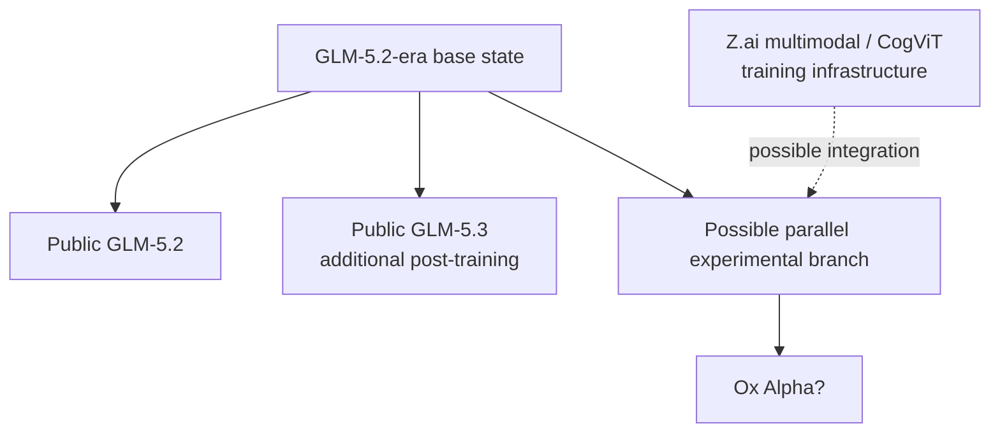
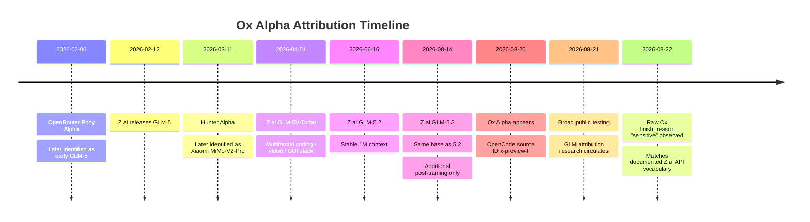
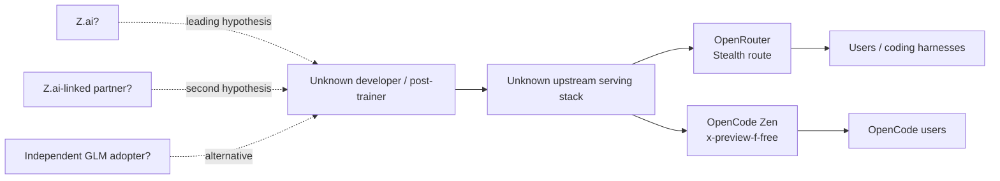
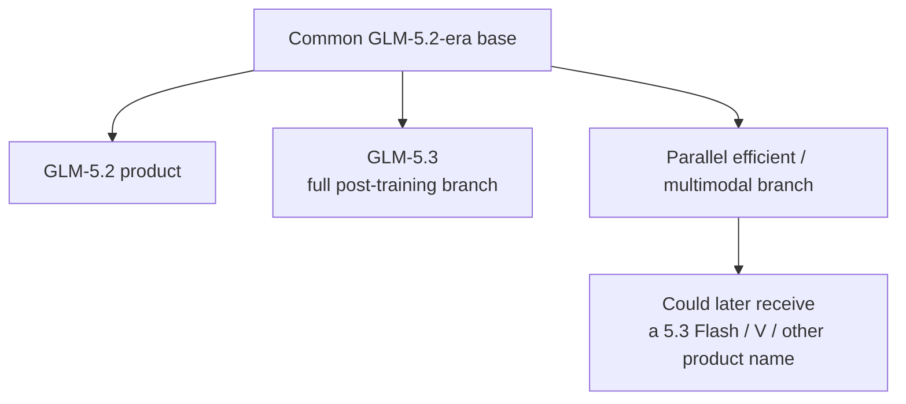

# Ox Alpha Attribution Dossier

## Executive assessment

**Assessment as of August 22, 2026:** the most likely explanation is that `stealth/ox-alpha` is **an unreleased Z.ai/Zhipu model or experimental checkpoint produced from the GLM-5.2-era base**, rather than a third party that independently adopted GLM-5.2. I assign that hypothesis roughly **68%** of the current attribution weight. A **Z.ai-linked partner, licensee, or jointly developed deployment** is the second-best explanation at roughly **16%**. Those probabilities are subjective intelligence-style judgments, not statistical posteriors.

The frozen OXFORD result remains untouched: **GLM-family trunk × GLM-5.2-like developmental baseline × distinct downstream multimodal child, not behaviorally identical to the tested public checkpoints.** fileciteturn0file0

What changes the ownership question is **new OSINT**, especially one clue that is considerably stronger than the Twitter chatter:

> A public OpenCode bug report captured Ox Alpha's **raw upstream finish reason `sensitive`** and separately notes handling for upstream `network_error`. Z.ai's official API documentation specifies the termination vocabulary **`stop`, `tool_calls`, `length`, `sensitive`, `network_error`**. That is an unusually specific API-dialect match. fileciteturn15file0L2-L2 citeturn27search3

That does not prove Z.ai—the OpenCode gateway or another intermediary could translate upstream responses—but it is the first public clue I found that potentially connects Ox not merely to **GLM weights**, but to a **Z.ai-like serving/API stack**.

Several other observations converge in the same direction. Z.ai has a direct history of using OpenRouter animal-named stealth previews: `Pony Alpha` was subsequently identified by OpenRouter as an early testing version of GLM-5. citeturn4search1 Z.ai already has native image/video/coding infrastructure in GLM-5V-Turbo, while GLM-5.2 supplies a production 1M-context backbone and long-horizon agent training stack. citeturn27search1turn7search0 And, critically, Z.ai says public GLM-5.3 uses **the same base model as GLM-5.2** and differs entirely through additional post-training. Therefore OXFORD's rejection of the **public GLM-5.3 behavioral checkpoint does not materially reject Z.ai as the developer**; it is fully compatible with Z.ai having multiple post-training branches from the same base. citeturn27search0

The strongest contrary fact is also real: GLM-5.2 is MIT-licensed, and Zhipu expressly released the weights publicly. Another sufficiently capitalized organization could legally modify, redistribute, and commercialize a descendant. citeturn8search0turn27search1 Thus GLM ancestry alone cannot establish corporate ownership.

My present ranking is:

| Candidate attribution | Subjective weight | Evidence grade ceiling | Core judgment |
|---|---:|---|---|
| **Z.ai/Zhipu internal unreleased branch** | **68%** | **A+B convergence** | Best fit to lineage prior, multimodal stack, OpenRouter precedent, post-training chronology, and API dialect. |
| **Z.ai-linked partner/licensee/joint project** | **16%** | A/D | Explains GLM inheritance and Z.ai-like serving while allowing a non-Z.ai product owner. |
| **Xiaomi or another major Chinese lab using GLM-5.2** | **6%** | D | Technically capable and stealth-preview precedent exists, but requires choosing GLM rather than the lab's own foundation model. |
| **Other major Chinese lab** | **4%** | D | Legally and technically possible; no positive organization-specific artifact found. |
| **Western coding/inference company using GLM** | **3%** | D | Possible under MIT and strategically sensible for coding, but no positive documentary trail. |
| **Google/DeepMind using GLM weights** | **1%** | D/E | Social-media theory exists; no documentary or operational support, and it requires Google to use a competitor's GLM foundation. |
| **Other/unknown explanation** | **2%** | — | Residual for an unidentified organization or a misunderstood serving arrangement. |

The important distinction is that **developer/post-trainer attribution is now stronger than serving-operator attribution**. OpenRouter is an aggregator and explicitly works through third-party model providers; OpenCode Zen is likewise a gateway that works with model teams and providers. Neither public interface exposes the actual upstream company for Ox. citeturn1search1 fileciteturn8file0L1-L2

My confidence ordering is therefore:

\[
\text{GLM ancestry} \gg
\text{Z.ai-or-Z.ai-linked post-training} >
\text{Z.ai internal specifically} >
\text{actual inference host}.
\]

The attribution problem is **worth pursuing**, but the highest-value surface is now source code, provider metadata, release infrastructure, and insiders—not additional behavioral genealogy.

## Evidence model and frozen prior

The investigation uses the user's evidence grades without allowing repetition to masquerade as corroboration:

| Grade | Meaning | Examples in this dossier |
|---|---|---|
| **A** | Direct documentary evidence | Official Z.ai model/release/API docs; OpenRouter's retrospective identity of Pony Alpha; public OpenCode source code. |
| **B** | Strong independent technical evidence | Frozen OXFORD prior; independently captured operational response fields; reproducible external model fingerprinting. |
| **C** | Credible informed reporting/leak | A named person asserting private confirmation but withholding identity. |
| **D** | Circumstantial evidence | Timing, capability fit, hiring, launch patterns, product conventions. |
| **E** | Rumor/speculation | Reddit interpretation, unattributed “insider” claims, name-reading, vibes. |

The frozen scientific result is not re-scored here. It establishes only that Ox is a **GLM-family, GLM-5.2-like, separately post-trained multimodal child** and leaves the downstream trainer/operator unresolved. fileciteturn0file0

That creates an important Bayesian asymmetry. A Z.ai origin requires:

\[
\text{Z.ai takes its own 5.2-era base}
\rightarrow
\text{runs another post-training/multimodal branch}.
\]

A Google, Xiaomi, Alibaba, Moonshot, Cursor, or other third-party origin requires:

\[
\text{third party deliberately imports GLM weights}
\rightarrow
\text{builds substantial downstream training}
\rightarrow
\text{integrates multimodality}
\rightarrow
\text{serves the result anonymously}.
\]

The second chain is absolutely possible because GLM-5.2 is openly available under MIT terms, but it contains more organization-specific assumptions. citeturn8search0turn27search1

There is an equally important correction to the intuitive argument that “Ox is not public GLM-5.3, therefore it probably is not Z.ai.” Z.ai's August 14 GLM-5.3 announcement explicitly says:

> GLM-5.3 uses the **same base model as GLM-5.2**, and its gains come from post-training.

Z.ai says it spent the preceding month scaling more environments, more diverse tasks, and more post-training compute on that common base. citeturn27search0

So a realistic internal topology is:



That diagram is an **inference**, not a claim that this is Z.ai's actual internal checkpoint graph. It simply demonstrates why rejection of the public 5.3 branch is compatible with Z.ai authorship. The inference is supported by Z.ai's own description of the shared 5.2/5.3 base and its separately documented multimodal GLM-V stack. citeturn27search0turn7search0

There is another chronology correction that matters. Public `GLM-5-Turbo` and `GLM-5V-Turbo` appeared in March and April 2026, **before** GLM-5.2's June 16 launch. They should therefore be used as evidence about Z.ai's post-training/product/vision infrastructure, not treated as literal children of the final public GLM-5.2 checkpoint. citeturn7search1turn27search1

That makes the frozen conclusion quite compatible with an internal parallel branch:

> **same broad Z.ai foundation-development program, different downstream trajectory.**

## Verified chronology and operational surface

The verified chronology is unusually suggestive because Ox arrived only six days after Z.ai publicly disclosed that it had been scaling post-training on the 5.2 base.

| Date | Verified event | Attribution relevance | Grade |
|---|---|---|---|
| **Feb. 6, 2026** | OpenRouter's `Pony Alpha` stealth preview later becomes identified on OpenRouter as an early testing version of **GLM-5**. citeturn4search1 | Direct precedent for Z.ai testing an unreleased GLM through OpenRouter's stealth mechanism. | **A** |
| **Feb. 12** | Z.ai launches GLM-5, a 744B-total/40B-active MoE, describing its own large-scale asynchronous RL infrastructure `slime`. citeturn27search2 | Establishes Z.ai's compute/training ability at the relevant scale. | **A** |
| **Mar. 11** | OpenRouter's `Hunter Alpha` is identified as an early MiMo-V2-Pro test. citeturn4search0 | Shows Xiaomi also has a direct stealth-preview precedent. | **A** |
| **Mar. 15** | Z.ai releases GLM-5-Turbo. citeturn7search1 | Demonstrates a distinct Z.ai agent-oriented branch/product recipe. | **A** |
| **Apr. 1** | Z.ai releases GLM-5V-Turbo, described as a native multimodal coding foundation model for image/video/text, GUI agents and coding. citeturn7search0turn7search1 | Establishes the in-house multimodal infrastructure needed for an Ox-like child. | **A** |
| **Apr. 13** | OpenRouter's `Elephant Alpha` is later identified as Ling-2.6-Flash. citeturn4search8 | Additional evidence that animal-Alpha previews are a real pre-release evaluation channel rather than a one-off gimmick. | **A** |
| **Jun. 16** | Z.ai launches GLM-5.2 with stable 1M context, flexible reasoning effort and long-horizon/agentic post-training infrastructure; weights are public. citeturn27search1 | Supplies the exact era/base family in the immutable scientific prior. | **A** |
| **Aug. 14** | Z.ai launches GLM-5.3 and says it uses the **same base model as 5.2**, with all improvements from the previous month's additional post-training. citeturn27search0 | Makes a simultaneous unseen sibling branch technically and organizationally plausible. | **A** |
| **Aug. 20** | Ox Alpha is publicly launched through the OpenRouter/OpenCode ecosystem. OpenCode's first repository commit I found adding it is timestamped **17:31:56 UTC**, using model ID `x-preview-f`. fileciteturn11file0L2-L2 | Hard documentary timestamp; also exposes a pre-release-style internal alias. | **A** |
| **17 minutes later** | OpenCode changes the public Zen ID to `x-preview-f-free` and the display name to `Ox Alpha Free`. fileciteturn12file0L2-L2 | Confirms `x-preview-f` predates the polished public free-tier label. | **A** |
| **Aug. 20–21** | OpenCode promotes Ox as a free, limited preview with 1M context, multimodality and zero-data-retention, while publicly claiming capacity of **100 trillion tokens/day**. citeturn15search11turn16search3 | Indicates a coordinated, high-capacity model-team/provider relationship. It does not identify which team. | **A for statement; D for ownership inference** |
| **Aug. 21** | Independent technical attribution work publicly points toward the GLM/Z.ai ecosystem; Chinese-language reporting summarizes the same evidence while noting no Z.ai confirmation. citeturn17search8turn21search11turn21search1 | Independent corroboration of the broad GLM direction, but not corporate proof. | **B/D** |
| **Aug. 22** | An OpenCode user captures Ox raw finish reason `sensitive`; the issue also documents `network_error` as another nonstandard provider finish reason handled in this path. fileciteturn15file0L2-L2 | Potential serving-stack fingerprint. | **B** |
| **Aug. 22** | Z.ai's official API documentation independently lists `sensitive` and `network_error` among its model termination reasons. citeturn27search3 | Strongest current operational convergence on Z.ai. | **A** |



### What Ox's public serving surface actually tells us

The public feature combination is distinctive but not unique: roughly **1,048,576-token context, 131,072-token maximum output, text/image/video input, reasoning modes, tools and structured-output support** are reported in OpenRouter-derived metadata and OpenCode's current model listings. citeturn3search0turn16search3

Several of those numbers line up naturally with Z.ai. GLM-5.2's official evaluation uses 1M context and up to 128K-class generation, while Z.ai's GLM-5/5V APIs commonly use a 131,072-token ceiling. citeturn27search1turn7search8 Public GLM-5.3 likewise supports 1M-context evaluation, `low/high/max` reasoning effort and 128K output. citeturn27search0

But those values are **not ownership fingerprints**. Competing models increasingly converge on 1M context, long reasoning, multimodality and large outputs.

The unusual clue is the **protocol behavior**.

A user testing `opencode/x-preview-f-free` reported database records containing:

```text
finish = error
rawFinish = sensitive
```

and described OpenCode code that separately recognizes a raw provider `network_error`. fileciteturn15file0L2-L2

Z.ai's own API reference defines:

```text
stop
tool_calls
length
sensitive
network_error
```

as finish reasons. citeturn27search3

That is much more specific than “both models use OpenAI-compatible APIs.” Standard OpenAI-compatible gateways often normalize moderation termination differently; the exact pair `sensitive` + `network_error` is therefore potentially an upstream dialect fingerprint.

I would grade the combined inference **B**, not A, because there are at least three alternative explanations:

1. OpenCode's Zen gateway could translate an arbitrary upstream response into Z.ai-style terminology.
2. A partner could be serving a GLM child through a Z.ai-compatible gateway.
3. Another provider could deliberately implement Z.ai's API conventions.

Nevertheless, a generic independent third-party fine-tune must now explain **both the GLM-model inheritance and the Z.ai-like termination vocabulary**. That raises the cost of the third-party hypothesis.

### What OpenCode knows—and what its public code does not reveal

OpenCode's source contains a normalization rule:

```text
"x-preview-f" → "ox-alpha"
```

while known-family identifiers such as `glm`, `gemini`, `mimo`, `kimi`, `qwen` and others are separately mapped to their known authors. Ox is not directly mapped to one of those known authors in the public code. fileciteturn4file0L2-L5

The chronology is revealing: Ox first entered OpenCode's public docs as `x-preview-f`, then was changed minutes later to `x-preview-f-free`. fileciteturn11file0L2-L2 fileciteturn12file0L2-L2

**Do not read the `f` as “Flash.”** That is tempting but unsupported. It could mean free, forward, preview-F, an internal experiment bucket, or nothing semantic at all. The later addition of `-free` actually makes a naïve “F = Flash” interpretation less compelling.

OpenCode's Zen documentation says the company tests models, talks to their teams about how best to run them, and works with providers to serve them correctly. Ox is exposed through OpenCode's own OpenAI-compatible Zen endpoint. fileciteturn8file0L1-L2 That makes OpenCode a **valuable witness and distribution partner**, but does not establish OpenCode as either trainer or underlying inference host.

OpenRouter itself similarly acts as an aggregation/routing layer over model providers, and its stealth framework deliberately obscures provider identity. citeturn1search1turn1search14

Thus the current public topology is:



The reported **100T tokens/day** deserves particular skepticism as an attribution clue. OpenCode made the claim publicly, but if interpreted literally as continuously processed tokens it corresponds to approximately **1.16 billion tokens per second**. That is better understood as a commercial capacity/quota statement or aggregate reservation than a physical sustained decode-rate measurement unless OpenCode provides a more precise definition. citeturn15search11 It proves someone was willing to underwrite a very large free preview; it does not tell us whose GPUs they were.

## The case for Z.ai—and the best arguments against it

The case for Z.ai is not one clue. It is the **intersection of six mostly independent evidence channels**.

| Evidence | Grade | Independent? | Effect |
|---|---|---:|---|
| Frozen GLM/5.2-like lineage prior | **B** | Yes | Large increase for Z.ai, but also all GLM licensees. fileciteturn0file0 |
| Z.ai owns the source model program and publicly releases 5.2 weights | **A** | Yes | Makes internal continuation the simplest path. citeturn27search1turn8search0 |
| Z.ai's public 5.3 is explicitly a post-training branch of the same 5.2 base | **A** | Yes | Makes an alternative sibling branch plausible despite Ox ≠ public 5.3. citeturn27search0 |
| Z.ai already possesses native multimodal/video/coding/GUI infrastructure in GLM-5V | **A** | Yes | Removes the need to posit an outside lab building an equivalent multimodal stack from scratch. citeturn7search0 |
| Pony Alpha was an OpenRouter stealth preview of GLM-5 | **A** | Yes | Direct behavioral precedent for Z.ai using this exact launch mechanism. citeturn4search1 |
| Ox raw termination vocabulary overlaps Z.ai's documented `sensitive` / `network_error` API dialect | **A+B** | Mostly | Most organization-specific operational clue found. fileciteturn15file0L2-L2 citeturn27search3 |

**The technological fit is strong.** Z.ai's official GLM-5.2 report describes stable 1M context, substantial serving optimization for that context length, long-horizon coding-agent RL and parallel OPD training. citeturn27search1 GLM-5V-Turbo already accepts text, images and video and is explicitly designed for multimodal coding, long-horizon action, GUI agents and tool use. citeturn7search0 GLM-5.3 demonstrates that in July–August Z.ai was actively spending additional compute on broad post-training experiments from the same 5.2 base. citeturn27search0

That is almost exactly the organization you would expect to be capable of producing the frozen Ox phenotype without adopting anyone else's technology.

**Compute plausibility is not a concern.** Z.ai already trained GLM-5 at 744B total parameters/40B active on 28.5T pretraining tokens and describes its own large-scale RL infrastructure. citeturn27search2 It has therefore demonstrated the capability to perform post-training and serve models in the same broad computational class.

**The hiring evidence is directionally consistent but weak for attribution.** Recent Chinese-language recruitment material describes Zhipu hiring across foundation-model R&D, post-training, agentic coding, RL, infrastructure, multimodal understanding/video/OCR and evaluation. citeturn26search0turn26search6turn26search4 That tells us Z.ai is investing in exactly these capabilities, but frontier AI companies routinely hire in those categories. I grade it **D**.

**The strongest argument against Z.ai is the absence of a direct documentary reveal.** As of August 22, I found no indexed first-party Z.ai blog, official API model enum, Hugging Face repository or public GitHub artifact naming `Ox Alpha` or definitively linking it to an unreleased Z.ai model. Z.ai's public announcement remains GLM-5.3, not Ox. citeturn27search0turn8search14turn8search15

A second counterargument is that the frozen prior specifically says Ox is **not behaviorally identical to the tested public GLM-5.3, GLM-5-Turbo or GLM-5V-Turbo checkpoints**. fileciteturn0file0 This prevents us from taking a lazy route such as “it is just GLM-5V-Turbo behind a wrapper.”

But it is much weaker evidence against **Z.ai ownership** because the company itself tells us that large behavioral changes can arise solely through additional post-training on a common base. citeturn27search0

A third argument against Z.ai is the MIT license. There is no proprietary-weight barrier preventing another lab from doing this. citeturn8search0

That leaves the central adversarial question:

> Why should we prefer “Z.ai trained another branch” over “somebody else downloaded GLM-5.2 and trained another branch”?

The answer is not just Occam's razor. It is that the outside lab must simultaneously explain:

- why it chose GLM over its own foundation model;
- how it acquired/built an Ox-grade multimodal stack;
- why the model surfaces Z.ai-like API termination vocabulary;
- why it used a launch channel that Z.ai has already used for GLM;
- and why no organization-specific artifact currently points toward that outside lab.

That is possible, but less economical.

## Suspect universe and ranked attribution

The ranking below separates **model developer/post-trainer**, **product owner**, and **serving operator**, because those can be different companies.

### Attribution matrix

| Suspect | Lineage fit | Timeline fit | Multimodal/agent capability | Stealth-preview precedent | Serving/API fit | Positive documentary clue | Major contradiction | Overall |
|---|---|---|---|---|---|---|---|---|
| **Z.ai internal** | Excellent | Excellent | Excellent | **Yes: Pony Alpha** citeturn4search1 | **Strong: finish-reason dialect** citeturn27search3 | Common 5.2/5.3 base; GLM-V stack citeturn27search0turn7search0 | No direct Ox/model-ID disclosure | **68%** |
| **Z.ai partner/licensee** | Excellent | Good | Good if Z.ai tech/API involved | Indirect | Strong-to-moderate | MIT enables derivative; partnership route could preserve Z.ai API citeturn8search0 | No partner identified | **16%** |
| **Xiaomi/MiMo** | Requires imported GLM | Good | Excellent | **Yes: Hunter Alpha** citeturn4search0 | Weak | Has an active multimodal/agent model program | Why use GLM rather than MiMo? No Z.ai-dialect explanation | **6%** |
| **Alibaba/Qwen** | Requires imported GLM | Good | Excellent | No comparable positive Ox clue found | Weak | Large 1M/multimodal/coding program exists citeturn25search0 | Frozen prior is GLM rather than Qwen; no GLM-adoption artifact | **<2% individually** |
| **Moonshot / MiniMax / Tencent / Baidu / ByteDance / DeepSeek** | Requires imported GLM | Plausible | Strong | Mixed/unknown | Weak | All possess substantial model/inference capability | No positive GLM-Ox documentary trail | **~2–3% combined within “other Chinese”** |
| **OpenCode or an inference partner commissioning a custom model** | Plausible | Very good | Depends on partner | OpenCode directly distributes stealth models | Strong distribution fit | OpenCode has direct model-team/provider relationships and a hidden alias fileciteturn8file0L1-L2 | OpenCode presents itself as gateway/evaluator, not foundation-model lab | Incorporated mainly in **partner 16%** |
| **Cursor/Anysphere, Poolside, other Western coding lab** | Requires imported GLM | Plausible | Strong coding; multimodal varies | No positive precedent found | Unknown | MIT weights reduce legal barrier | No model/document/provider traces; expensive independent post-training/serving | **3% combined** |
| **Google/DeepMind** | Requires deliberately importing GLM | Timing plausible | Excellent | No Ox-specific precedent found | Poor | Social hype only | Frozen prior excludes Gemini trunk; no GLM-use artifact; API clues point elsewhere | **1%** |

### Z.ai-linked partner or licensee

This is the strongest alternative to a fully internal Z.ai project because it explains why the frozen child could be genuinely distinct while retaining GLM-family machinery.

GLM-5.2's MIT license permits commercial modification and distribution. citeturn8search0 A cloud provider, enterprise AI company or coding-agent company could therefore continue training it. If the partner retained Z.ai as an inference provider—or built against Z.ai's API—the `sensitive/network_error` dialect could also survive without Z.ai owning the final product. citeturn27search3

What is missing is **an actual partner**. I found no public announcement tying OpenCode, OpenRouter, Xiaomi, a Western coding vendor or a cloud provider to a custom GLM-5.2-derived multimodal checkpoint.

The distinction between internal and partner origin may ultimately be impossible to resolve from model behavior alone.

### Xiaomi/MiMo

Xiaomi deserves to remain on the board because it has a direct OpenRouter stealth precedent: `Hunter Alpha` became an early testing version of MiMo-V2-Pro. citeturn4search0 Xiaomi also operates its own increasingly capable agentic/multimodal model program. citeturn25search1 Some recent MiMo configurations have top-line context/output/multimodal characteristics similar to Ox, which contributed to early speculation. citeturn25search2turn25search5

But under the immutable prior, “Ox is Xiaomi” cannot mean “Ox is secretly a MiMo checkpoint.” It would have to mean:

\[
\text{Xiaomi}
+
\text{Z.ai GLM-5.2 weights}
+
\text{new Xiaomi downstream training}.
\]

That is much less natural. A lab investing heavily in its own foundation architecture normally has less reason to start its next flagship from a competitor's giant open checkpoint. There is also no public Xiaomi artifact connecting its model program to GLM-5.2.

The Z.ai-like finish-reason vocabulary makes this hypothesis harder still. fileciteturn15file0L2-L2 citeturn27search3

I therefore retain Xiaomi chiefly because its **launch behavior and infrastructure capability** fit, not because there is affirmative evidence it trained Ox.

### Alibaba, DeepSeek, Moonshot, MiniMax, Tencent, Baidu and ByteDance

These organizations have the capital, research staff and infrastructure to post-train or serve a large open-weight model. Current Chinese model competition includes 1M-context, multimodal and coding-agent systems from several of them. citeturn25search0turn16search3

But after imposing the frozen GLM prior, each suffers the same problem as Xiaomi with **less positive evidence**: it would have to use a Z.ai foundation despite possessing its own active foundation-model family.

I found no first-party artifact indicating Qwen, DeepSeek, Kimi, MiniMax, Tencent/Hunyuan or Baidu was experimenting publicly with a GLM-5.2-derived Ox-like branch.

That does not rule them out. It puts them in the “technically possible, evidentially unsupported” bucket.

### Western coding labs and inference vendors

This is more plausible than it may initially sound. MIT licensing means a Western company could legally use GLM-5.2 as a foundation for a proprietary coding model. citeturn8search0 A coding-focused company also has an obvious reason to seek a strong, open, 1M-context model rather than pretrain a 700B-class MoE from zero.

But Ox appears to include significant multimodal and long-output infrastructure, and the free stealth launch was accompanied by extremely aggressive capacity claims. citeturn15search11turn3search0 That raises the minimum organizational footprint. Such a project would likely involve either a major inference partner or a model lab with substantial compute.

No public commit, product roadmap, model card, SDK string or staff statement found in this search connects a Western coding company to a GLM-5.2 multimodal derivative.

The possibility is therefore **real but currently evidence-poor**.

### Google/DeepMind

The Google theory should be separated into two entirely different claims.

**“Ox is Gemini.”** The frozen scientific prior rejects that model-family explanation. fileciteturn0file0

**“Google took GLM-5.2 and trained its own descendant.”** That remains logically possible under the MIT license. citeturn8search0

But there is currently no documentary evidence for the second story. The Google/DeepMind case rests primarily on social-media interpretation: DeepMind researchers appeared enthusiastic or suggestive about Ox, leading Reddit and aggregator discussions to interpret that as a Gemini hint. The discoverable sources do not establish that the researchers said Google built Ox, and some of the material is explicitly automated/secondary summary. citeturn22search0

For Google to win this attribution, we currently need to assume:

1. Google deliberately selected a Z.ai open foundation instead of Gemini;
2. Google performed substantial separate post-training;
3. Google retained or reproduced a GLM/V-like multimodal surface;
4. the result somehow emits a Z.ai-like API termination dialect;
5. Google then previewed it anonymously through OpenRouter/OpenCode;
6. yet no code, documentation or model-family artifact discloses that GLM relationship.

That is too many unsupported auxiliary assumptions for social-media hype to overcome.

My estimate is therefore **~1%**, not zero.

## Rumor genealogy, the GLM-5.3 Flash claim, and the conspiracy board

### The discoverable rumor genealogy

The social record is much noisier than the technical one, and X/Twitter indexing is incomplete. “Earliest discoverable” therefore does **not** mean guaranteed first-ever post.

| Narrative | Earliest useful public root I could establish | Grade | Independence / assessment |
|---|---|---|---|
| **“Ox is probably GLM/Z.ai”** | Independent Aug. 21 technical investigation comparing tokenization, video handling, audio behavior and other model surfaces; Chinese reporting subsequently amplified it. citeturn17search8turn21search11 | **B for measurements; D for ownership conclusion** | Genuinely independent of ordinary Twitter rumor; direction agrees with frozen prior. |
| **“Maybe Xiaomi/MiMo”** | Early Chinese/social speculation based on Xiaomi's upcoming-model timing and its prior stealth OpenRouter use. citeturn17search7turn17search9 | **D/E** | Plausible suspect generation, not evidence of GLM adoption. |
| **“Ox = GLM-5.3 Flash”** | Circulating Aug. 21–22 leak/rumor. A contemporaneous Japanese roundup explicitly treats the alleged internal `GLM-5.3 Flash` information and Ox as separate claims and says there is no confirmation they are the same checkpoint. citeturn16search2 | **C-/D at best** | No first-party Z.ai artifact found. Reposts should be counted as one underlying rumor, not independent corroboration. |
| **“DeepMind/Google is hinting that it's Gemini”** | Interpretation of researcher social posts, later amplified by Reddit/aggregator discussion. citeturn22search0 | **E/D** | Social signaling, not provenance evidence. Frozen model-family prior contradicts literal Gemini interpretation. |
| **“Insiders know but cannot say”** | Researcher Omar Sar publicly said he had received confirmation of Ox's identity but could not disclose it, while describing it as a major multimodal/agentic model. citeturn15search12 | **C** | Useful evidence that the reveal was known privately; provides **zero candidate-specific information** until identity is disclosed. |
| **OpenRouter expects a major reveal** | OpenRouter co-founder Alex Atallah publicly described Ox as a new frontier model, its first stealth launch “in a while,” and expected a significant launch. citeturn15search12 | **A for OpenRouter's position** | Suggests a meaningful model partner; does not identify which partner. |

### Audit of the “GLM-5.3 Flash” claim

I would **not currently write “Ox is GLM-5.3 Flash” in the main assessment**.

The evidence for that specific product name is much weaker than the evidence for Z.ai generally.

As of August 22:

- Z.ai's first-party current release is **GLM-5.3**, announced August 14. citeturn27search0
- I found no indexed first-party Z.ai blog post, official Hugging Face model, public GitHub artifact or official release entry naming an active `GLM-5.3 Flash` model.
- Z.ai has used **Flash** naming elsewhere, so the name itself is perfectly plausible; it is not inherently suspicious. citeturn7search2
- A contemporaneous roundup that discusses alleged internal `GLM-5.3 Flash` information explicitly warns that this and Ox are separate observations and that equivalence is unconfirmed. citeturn16search2
- I could not authenticate an original indexed post from the frequently cited `synthwavedd` claim strongly enough to elevate it to documentary evidence.

So:

\[
P(\text{Z.ai}) \gg P(\text{exact product name = GLM-5.3 Flash})
\]

in this dossier.

Importantly, an eventual reveal as **“GLM-5.3 Flash” would not automatically falsify the frozen OXFORD genealogy**. Z.ai's product naming does not logically require every “5.3” variant to be obtained by taking the final public GLM-5.3 checkpoint and distilling it. Z.ai itself says public 5.3 and 5.2 share a base and differ through post-training, making parallel branch naming entirely plausible. citeturn27search0

A hypothetical internal tree could therefore be:



Again, that is a **falsifiable organizational hypothesis**, not recovered genealogy.

### Wild theories and their falsification tests

| Theory | What must be true | Current support | Current contradiction | Clean falsification |
|---|---|---|---|---|
| **Z.ai secretly testing a parallel 5.2-derived multimodal/Flash branch** | Z.ai preserved a sibling checkpoint and integrated newer multimodal/post-training work. | Shared 5.2/5.3 base, GLM-V infrastructure, Pony precedent, Z.ai-like finish reasons. citeturn27search0turn7search0turn4search1turn27search3 | No first-party model ID/reveal yet. | Official reveal naming another developer; upstream metadata proving another lab. |
| **A Z.ai enterprise partner trained the child** | Partner obtained weights, compute and multimodal capability, perhaps using Z.ai inference APIs. | MIT license; would explain distinct alignment plus Z.ai API dialect. citeturn8search0turn27search3 | No partner identity or artifact. | Final model owned/trained entirely by Z.ai, with explicit lineage documentation. |
| **Xiaomi trained GLM-5.2 instead of MiMo** | Xiaomi chose Z.ai's foundation for a new product despite its own model stack. | Hunter Alpha precedent; strong multimodal/agent infrastructure. citeturn4search0turn25search1 | No GLM adoption evidence; Z.ai API dialect; frozen GLM prior prevents a simple MiMo explanation. | Model card/reveal identifying Z.ai or a non-Xiaomi developer. |
| **A Western coding company commissioned a GLM derivative** | Company partnered for large-scale post-training/vision/serving rather than pretraining itself. | MIT license; strong economic incentive for coding firms to use open models. citeturn8search0 | No repository, hiring, partner or API trace found; serving scale is substantial. | Upstream model ID or announcement tying Ox to Z.ai/Chinese lab. |
| **Google/DeepMind deliberately fine-tuned GLM** | Google used GLM rather than Gemini and hid that genealogy during preview. | Researcher hype interpreted as hints. citeturn22search0 | No documentary trace; frozen Gemini exclusion; Z.ai-like API signal. fileciteturn0file0 citeturn27search3 | Any official Z.ai/partner reveal; conversely, a Google model card acknowledging GLM would instantly validate it. |
| **OpenCode commissioned Ox** | OpenCode asked a model lab/provider for a custom checkpoint specifically for coding-agent workloads. | OpenCode says it works directly with model teams/providers and mounted a major free launch; hidden `x-preview-f` alias exists. fileciteturn8file0L1-L2 fileciteturn11file0L2-L2 | No evidence OpenCode itself conducts foundation-model post-training. | Contract/announcement showing ordinary preview distribution rather than commissioned training. |
| **The 100T/day preview is backed by some shared/national Chinese inference pool** | Enormous subsidized compute is being used as strategic distribution. | Only the capacity claim itself. citeturn15search11 | No provider, cloud or government evidence; wording may simply mean promotional allocation. | Disclosure of ordinary commercial inference provider/capacity arrangement. |
| **`x-preview-f` secretly encodes “Flash”** | OpenCode's internal `f` is the actual product-family suffix. | String ends in `f`. | No naming-key evidence; immediate public ID became `x-preview-f-free`, making semantics ambiguous. fileciteturn12file0L2-L2 | Another `x-preview-*` mapping revealing OpenCode's naming convention. |
| **A third party is deliberately mimicking Z.ai's API dialect to create a false flag** | Provider intentionally emits `sensitive/network_error` and preserves GLM surfaces to resemble Z.ai. | Technically possible. | No motive or evidence; adds unnecessary complexity. | Direct provider implementation/source revealing translation rules. |

The “conspiracy board” yields one useful methodological conclusion: **almost every exotic theory becomes testable through infrastructure metadata, while almost none becomes much more testable through another moral/coding prompt.**

## What would settle the attribution

### The highest-information unanswered questions

**Who does OpenCode's internal `providerModel` for `x-preview-f-free` actually name?**  
OpenCode's current public normalization layer is revealing because it explicitly handles aliases and provider-derived model authors, but the public source does not expose Ox's real upstream `providerModel`. fileciteturn4file0L2-L5 A future source-code change from:

```text
x-preview-f → ox-alpha
```

to something resembling:

```text
x-preview-f → glm-5.x-...
```

would be enormously more informative than another behavioral assay.

**Does raw Ox traffic expose more Z.ai-specific protocol vocabulary?**  
The `sensitive` clue is already significant. A stable combination of Z.ai-specific error codes, usage fields, request IDs, reasoning-content conventions or model-return identifiers would substantially increase attribution confidence if captured without an intermediary translation layer. fileciteturn15file0L2-L2 citeturn27search3

**Will a first-party Z.ai model ID appear before the reveal?**  
The most valuable search targets are Z.ai's API model listings, release notes, GitHub/Hugging Face repositories and SDK enums for previously unseen multimodal/efficient 5.x variants. Z.ai's current official public record establishes GLM-5.3 but not the alleged Flash identity. citeturn27search0

**Who underwrites the Ox free capacity?**  
OpenCode's 100T-token/day statement implies a substantial commercial arrangement but does not identify whether the resource comes from Z.ai, OpenCode, OpenRouter, a cloud vendor or a contracted inference provider. citeturn15search11 A provider disclosure would directly separate “developer” from “host.”

**What exactly did the people claiming private confirmation learn?**  
Omar Sar's public statement that he obtained confirmation but cannot disclose it is potentially high-value once the embargo lifts. Until then, it does not favor Z.ai, Google, Xiaomi or anyone else. citeturn15search12

### Monitoring checklist ranked by expected information gain

| Priority | Signal | Why it matters |
|---|---|---|
| **Highest** | **OpenCode commits/PRs involving `x-preview-f`, `x-preview-f-free`, `ox-alpha`, model aliases and provider normalization** | We already know a hidden alias leaked through this layer within minutes of launch. fileciteturn11file0L2-L2 fileciteturn4file0L2-L5 |
| **Highest** | **OpenRouter slug/provider rename at reveal** | Previous Alpha pages have retrospectively identified their real models, including Z.ai's Pony Alpha. citeturn4search1 |
| **Very high** | **Z.ai API/docs/Hugging Face/GitHub new model IDs** | A staged `glm-5.x-*` multimodal/Flash entry would be direct documentary evidence. |
| **Very high** | **Additional unnormalized API/error fields from Ox** | Could test whether the `sensitive/network_error` overlap is a genuine upstream Z.ai dialect rather than gateway normalization. citeturn27search3 |
| **High** | **OpenCode `/zen/v1/models` metadata changes** | May expose final product name earlier than marketing pages; OpenCode already carries the `x-preview-f-free` mapping. fileciteturn8file0L1-L2 |
| **High** | **Alex Atallah/OpenRouter and OpenCode/Theo reveal posts** | These parties demonstrably operate the preview channels and are much closer to the provider than outside commentators. citeturn15search12turn15search11 |
| **Medium-high** | **Z.ai/Jie Tang announcements and Chinese-language launch press** | Most direct path if Z.ai owns it; Chinese reporting already sees the GLM hypothesis but notes absence of confirmation. citeturn21search11 |
| **Medium** | **Omar Sar's eventual disclosure** | Potential C→A/B upgrade if he names his source and model. citeturn15search12 |
| **Low** | **Additional anonymous Twitter/Reddit “leaks”** | Useful only if they contain new documentary artifacts; repeated claims are not independent evidence. |
| **Very low** | **More unconstrained behavioral prompting of Ox** | Likely to refine phenotype, not identify corporate trainer. |

### Evidence that would materially change the ranking

**Z.ai internal rises from ~68% to >90%** if any of the following appears: a first-party Z.ai model ID corresponding to Ox; OpenRouter's stealth page is relabeled as a Z.ai model; an OpenCode source mapping exposes a Z.ai upstream ID; a Z.ai employee explicitly confirms the preview; or multiple additional raw API fields independently match Z.ai's otherwise unusual protocol.

**Z.ai internal falls below ~40%** if OpenCode/OpenRouter provider metadata names a non-Z.ai upstream, or a credible third-party organization publishes a GLM-5.2-derived model card whose checkpoint characteristics and launch timing demonstrably match Ox.

**The Z.ai-partner hypothesis rises sharply** if the upstream server is demonstrably Z.ai while the final product is announced by another company. That would reconcile the API-dialect clue, GLM ancestry and a distinct corporate owner.

**Xiaomi rises sharply** only with documentary evidence of GLM use. A new MiMo model that merely resembles Ox in context length or multimodality is not enough because the frozen scientific prior specifically places Ox on GLM lineage. fileciteturn0file0

**Google rises sharply** only if there is evidence that Google actually used GLM weights. More DeepMind researchers posting ox emojis or praising the model should barely change the posterior.

### Prioritized source stack

The most probative public sources, in descending order, are:

| Source | Why it is high-value |
|---|---|
| **OpenCode Ox operational bug trace** fileciteturn15file0L2-L2 | Captures raw `sensitive` termination behavior from `x-preview-f-free`. |
| **Z.ai official Agent API reference** citeturn27search3 | Independently documents the exact `sensitive` and `network_error` termination vocabulary. |
| **Z.ai GLM-5.3 announcement** citeturn27search0 | Establishes that 5.3 and 5.2 share a base and differ through post-training, directly informing ownership logic. |
| **OpenCode first Ox commit** fileciteturn11file0L2-L2 | Hard timestamp and hidden `x-preview-f` identifier. |
| **OpenCode alias source** fileciteturn4file0L2-L5 | Shows how the stealth ID is normalized and where a future provider-name leak could surface. |
| **OpenRouter Pony Alpha record** citeturn4search1 | Direct precedent for Z.ai using OpenRouter's anonymous-Alpha launch channel. |
| **Z.ai GLM-5.2 report** citeturn27search1 | Establishes 1M infrastructure and the specific base-era development program. |
| **Z.ai GLM-5V-Turbo documentation** citeturn7search0 | Establishes Z.ai's native image/video/coding-agent stack. |
| **GLM-5.2 MIT license** citeturn8search0 | The strongest reason *not* to overclaim ownership from genealogy. |
| **Independent public Ox investigation and Chinese reporting** citeturn17search8turn21search11 | Useful independent corroboration, while appropriately stopping short of corporate confirmation. |

### Final judgment

**Best current attribution:**  
**Z.ai/Zhipu internal unreleased model or experimental branch**, approximately **68%**. The combination of the frozen GLM-5.2-like prior, Z.ai's documented common 5.2/5.3 base, its native GLM-V multimodal stack, its prior `Pony Alpha` OpenRouter stealth launch, and especially the Ox/Z.ai `sensitive` + `network_error` API-dialect convergence makes this substantially stronger than “it's GLM, therefore maybe Z.ai.” fileciteturn0file0 citeturn27search0turn7search0turn4search1turn27search3

**Second-best explanation:**  
**A Z.ai-linked partner/licensee or jointly developed product**, approximately **16%**. This preserves the strong GLM/Z.ai infrastructure evidence while respecting the fact that GLM-5.2 is MIT-licensed and that the organization owning the final product need not be the organization owning the base weights. citeturn8search0

**Largest remaining uncertainty:**  
Whether the **distinct downstream work itself was done inside Z.ai** or by another organization with access to GLM-5.2 and possibly Z.ai's serving stack. The current evidence is much better at identifying the technological ecosystem than the legal/product owner.

**Most valuable new evidence to obtain:**  
A **non-anonymized upstream model/provider identifier**—ideally an OpenCode `providerModel` mapping, an OpenRouter post-reveal provider slug, or a first-party Z.ai API/SDK model ID. A single such documentary artifact could be worth more than dozens of additional behavioral observations.

**Will further behavioral probes on Ox materially change ownership attribution?**  
**Probably not.** The frozen behavioral work has already done its high-value job: it located Ox within a GLM-5.2-like developmental family and separated it from tested public checkpoints. fileciteturn0file0 Additional unconstrained prompting is more likely to characterize the unknown child than identify who trained it. Behavioral testing becomes high-value again only after a **specific new candidate checkpoint** appears; at that point the existing frozen fingerprints can be applied prospectively without changing the ruler.

The investigation has therefore crossed an important boundary:

\[
\boxed{
\text{The next decisive clue is more likely to come from a commit, API field, provider mapping, or announcement than from another prompt.}
}
\]